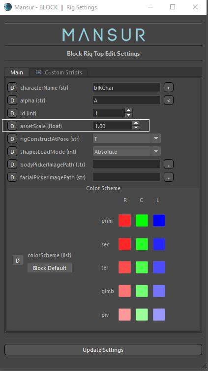
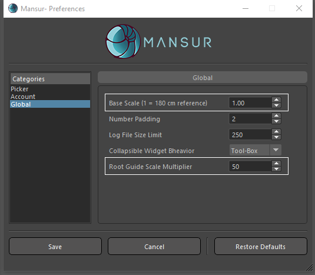
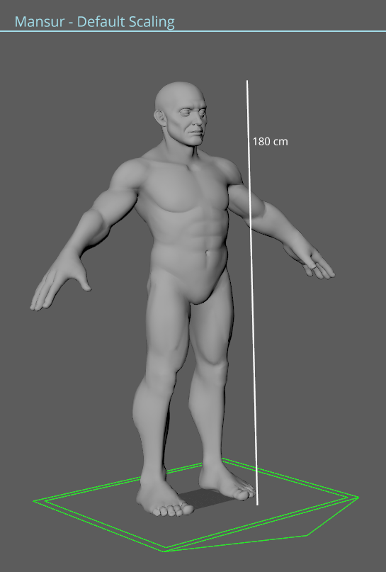

<font size = 3>
Mansur-Rig’s default scale is based on: Human-male character- 180cm in Height.

There are three values that dictate Asset scaling:
<ul>
	<li>Preferences - “Base Scale”, or “Project Scale”- Global scale multiplier.</li>
	<li>Rig-Top Setting - “Asset Scale”, Asset specific scale multiplier.</li>
	<li>Preferences - “Root Guide Scale” - This will dictate the multiplier for the “Root Guide” only.</li>
</ul>

 
 

Variables used internally :
<ul>
	<li><b><i>```mnsProjectScale```</i></b> - Located in "Preferences", is set by the user using the preferences UI, which can be accesed through Mansur's main menu.</li>
	<li><b><i>```assetScale```</i></b> - Rig-Top's attribute, can be accessed when creating a new Rig-Top, or via the "Rig settings" in Mansur BLOCK's main UI.</li>
	<li><b><i>```gScale```</i></b> - Compiled in MnsBuildModule Class = <i><b>```mnsProjectScale```</b></i> * <b><i>```assetScale```</i></b></li>
	<li><b><i>```spacing```</i></b> - This variable dictates the spacing (distance) between guides when creating them. This variable is <b><i>```gScale```</i></b> * 10</li>
</ul>

</font>


examples (Recommended Values):
<table border = 1>
	<tr background color>
		<td>Environment Scale</td>
		<td>Asset Height</td>
		<td>Base Scale</td>
		<td>Asset Scale</td>
		<td>Root Guide Scale</td>
	</tr>
	<tr>
		<td>1:1 (Real-Scale)</td>
		<td>180 cm</td>
		<td>1.0</td>
		<td>1.0</td>
		<td>50.0</td>
	</tr>
	<tr>
		<td>1:1 (Real-Scale)</td>
		<td>135 cm</td>
		<td>1.0</td>
		<td>0.75</td>
		<td>50.0</td>
	</tr>
	<tr>
		<td>1:1 (Real-Scale)</td>
		<td>45 cm</td>
		<td>1.0</td>
		<td>0.25</td>
		<td>50.0</td>
	</tr>
	<tr>
		<td>1:2 (Half-Scale)</td>
		<td>180 cm</td>
		<td>0.5</td>
		<td>1.0</td>
		<td>50.0</td>
	</tr>
	<tr>
		<td>1:4 (Quarter-Scale)</td>
		<td>135 cm</td>
		<td>0.25</td>
		<td>0.75</td>
		<td>50.0</td>
	</tr>
</table>


 
