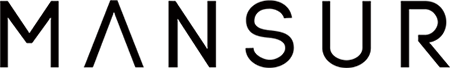

 

My name is Asaf Ben Zur and I'm a 3D Rigger & Developer for 3D Animation.

I know first hand how difficult it is to survive in the VFX & Animation world, and i believe that the only ones who can change that are the artists.
The fact that in-order to survive as an Animation or a VFX artist, you have to constantly strive for a higher position or a bigger studio- there you will be a part of a higher-budget projects, and higher-level tools as a result.

As a Rigger, I know for a fact that any 3D animation is limited to the rig provided. And when the rig fails- the animator's vision fails with it- forcing them to compremise.
I want to support creation by sharing some higher-end developments and tools- which are created mainly with animators in mind, to try and provide artists with a better envioroment to work in and tools that will allow better behavior, faster performance, and easier control.

The videos I make are mainly technical currently (which will change soon), but I try and make it as clear as possible for artists to recognize the potential to produce some amazing results with minimum effort, while trying to ignore my terrible animation skills.
The plugins I present are a part of a big modular rig builder I'm working on called BLOCK- which will use all of these plugins under the hood of the build-modules.

 

 

