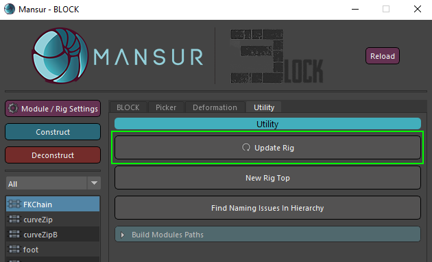
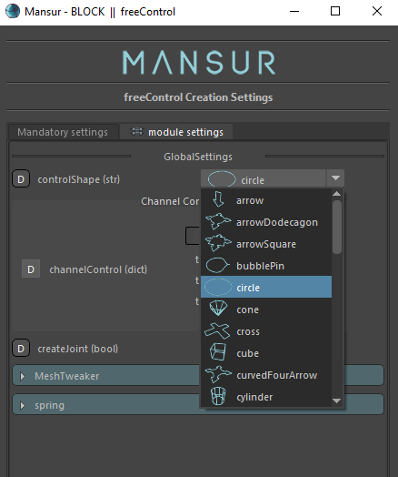
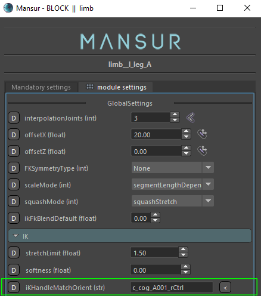
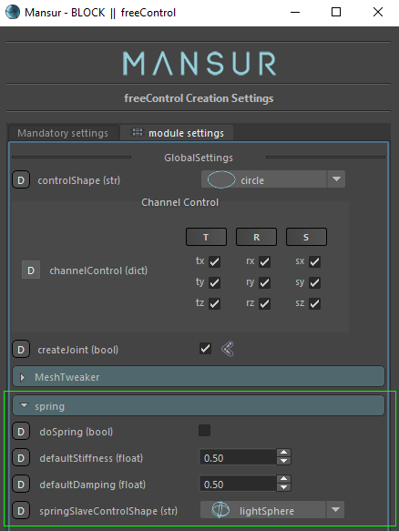

## Mansur-Rig 1.3.0

Released 15 May 2021

### Features
- New  centralized "Update Rig" utility in Block's utility tab. This method now consists of all previous update-related methods. This method will now execute all of the following processes:
	1. Update the rig-top structure in case it was changed.
	2. Fix module paths for all existing modules within the rig.
	3. Update all module attributes based on the currrent version settings.
<figure>
  
  <figcaption>Update-Rig Utility</figcaption>
</figure>
- Module name changes will now automatically update all module space lists that consist of the given module. i.e. all space attributes will be updated with the module's new name automatically.
- Read-Only mode was intoduced into dynUI. Now, instead of blocking a module-settings-load in puppet state, the settings window will now load, but it read-only mode. You can now view your settings in puppet state instead of needing to deconstruct, although editting the settings remains locked.
- Control-Shape Icons - All control shape related attributes now icludes icons!
<figure>
  
  <figcaption>Control-Shapes Icons</figcaption>
</figure>
- CNS/Sub-Controls creation and deletion methods were detached from the CNS-Tool's class in order to allow creating CNS/Sub-Controls using custom-scripts. Please use this example to use as a post-construction custom script: 

=== "Python"

    ``` python
    #import Mansur-Rig's Block-Utility python module, to access the method    
    from mansur.block.core import blockUtility as blkUtils
    
    #Using implicit control-names list
    blkUtils.createCnsForCtrls(["c_cog_A001_ctrl", "c_head_A001_ctrl"])
        
    #Using a simple right/left loop for efficiency and ease of use
    for side in "rl": 
        blkUtils.createCnsForCtrls(side + "_armIkTarget_A001_ctrl")
    ```
- limb module - Added a "IK-Handle Orientation Match" feature by request. Using this feature you can now choose to override the native orientation of the IK-Handle control. You can now input a guide into this attribute to the orientation to, and this orientation will override any other orientation related attribute. This was requested in order to fully align all IK handles orientations.
<figure>
  
  <figcaption>IK-Handle Match Orient Attribute</figcaption>
</figure>
- freeControl - Spring layer! You can now easily create a simple spring action for your free-controls. Create a procedural secondary motion in seconds!
<figure>
  
  <figcaption>freeControl spring layer</figcaption>
</figure>
- Space attribute re-ordering guide was inserted into the attribute's description. Please use drag-drop within the list to change spaces order.
- Deformation tab was updated with icons.
- curveZipB - New mid-curve generation feature was intoduced into the module. Please see mnsCurveZipB notes below.
- curveZipB - Attachment curves feature stabalized. Pleasee see mnsBuildTransformsCurve node notes below.

### Bug fixes
- \#74- Copy-Skin related issues resolved. This method is now fully stabalized.
- freeControl "meshTweaker" section attrbiute descriptions were updated and clarified. 

### Transition Log
- Please use the new centralized "Update Rig" utility button in Block's utility tab to update rigs built with previous versions of Mansur-Rig

### mnsMayaPlugins v 1.0.7
- mnsBuildTransformsCurve- Upgraded. Added "centerMatrix" attribute and offset curve build based on it. This was done in order to stablize the attachment curves feature in curveZipB module. Now the attachments offset curves will be built using the module's root guide as a center matrix which will result in a much stabler behaviour.
- mnsCurveZipB - Upgraded. Added a new Mid-Curve-Generation support, in order to smooth the meet mid curve for all related "mid" attrbiutes. The new addition is the "midCurveGenerationMode" and "midCurveResolution" attributes. In case "regenerate" mode is choosen for the mid curve generation, a new mid-curve will be constructed given the resulotion instead of using the input curves' resolution. This will result in a much nicer and smoother mid-curve.
- mnsSphereVectorPush Node released!