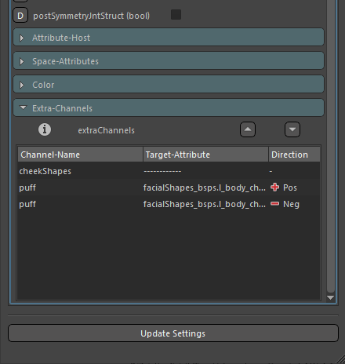
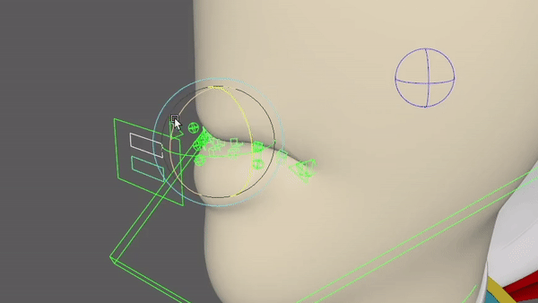
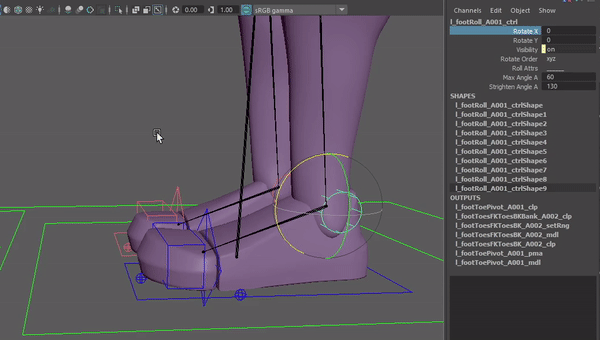

## Mansur-Rig 1.3.1

Released 04 Jun 2021

### Features
- New mnsSphereVectorPushNode method to be used in the Synamic UI Creator tool.
- FKChain Module - Added "doPrimariesSpaceSwitch" feature to allow IK mode using FK chain. This feature, when on, will create an FK heirarchy using constraints, instead of a direct heirarchy. With that, all primary FK controls will receive a space switch, which is defaulted to it's native parent, to create the FK behaviour.This will allow to break the FK heirarchy if needed by setting the primary controls to any space we choose, creating the IK behaviour.
- New Extra Channels feature!
    1. At the bottom of the core module settings tab, there is a new drop-down called extra channels.
    2. This feature was created mainly with blend shape targets in mind.
    3. If ever you are confused about what this feature is, check out the info box tooltip- there is a full explanation there.
    4. Any row within this list will create a custom attribute with the selected name on the given module main control, and connect to the given attribute.
    5. This feature is assuming that the target attribute range is 0-1. Once again mainly with blend-shape targets in mind.
    6. Use the direction column to choose the channel's control direction. Negative direction will be revesed to the 0 to 1 range when connected.
    7. For example, in case you have 2 shapes, one for expantion and one for contraction, you can create 2 rows with the same attrbiute name, one in the positive direction- connected to the expantion shape, and one in the negative direction- connected to the contraction shape.
    8. This will result in a single attribute that ranges between -1 and +1, while 0 to -1 will control the contraction shape, and 0 to +1 will control the expantion shape.
    9. You can Use dividers as well to group attributes in case you need to. All attributes will be created in the same order they are listed in
<figure>
  
  <figcaption>Extra-Channels Feature</figcaption>
</figure>
- Lip-Curls introduced in lips Module! Please re-create your module from previous versions of Mansur-Rig. Now, the Lips module will create 2 new extra custom guides, to choose the upper and lower lip curl pivots. These will then be added into the setup using the main upper and lower lip controls rotation to curl the lips from the selected pivots.
<figure>
  
  <figcaption>Lip Curls</figcaption>
</figure>
- Implemented argument disable ability in DynUI.
- Block- Module symmetry will now work on multiple module selection.
- CurveZipB Follow feature will now except rootGuides as input as well as joints, and convert on construcion.
- Foot module - Foot roll behaviour upgraded. A new Channel "strighten-Angle" was introduced, to choose the range to straighten the toes back when exceeding the roll Max-Angle to achive more realistic results. Please reconstruct your puppets to get this feature created.
<figure>
  
  <figcaption>New Foot Roll</figcaption>
</figure>

### Bug fixes
- Block - deformation tab- left mesh list was not working at all- Fixed. 
- FKChain- Using "secondary-ik" layer in combination with "isolate-poles" feature, was breaking the module on deconstruction- Fixed.
- Block - Module symmetry was not handeling set space defaults correctly- fixed.
- \#77 - Block wasn't loading when the preferences directory was not found for some reason- Fixed.
- \#79 - CurveZipB - Mid Curve Regeneration minimum was decreased to 1 by request.
- Callback errors on Picker load - fixed.
- CurveZipB - Construction faliure when there are no vertex inputs- fixed.
- All annoying warning: "Warning: pymel.core.general : Could not create desired MFn. Defaulting to MFnDagNode." where removed. Bug found at origin and fixed.

### Transition Log
- Please use the new centralized "Update Rig" utility button in Block's utility tab to update rigs built with previous versions of Mansur-Rig
- To get the new foot roll, please reconstruct.
- To update lip module- please delete it and re-create.

### mnsMayaPlugins v 1.0.8
- mnzLipZip - Added lip curls feature.