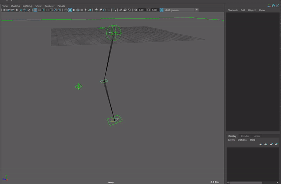

## Mansur-Rig 1.3.2

Released 20 Jun 2021

### Features
- New Ctrl/Guide toggle in Block
<figure>
  
  <figcaption>Ctrl/Guide Toggle</figcaption>
</figure>

### Bug fixes
- Maya 2022 installation bugs (\#84)- Fixed. Installation in Maya 2022 and all fuctionallities is now fully available in Maya 2022
- Main Joint Structure Joints- Previously, all transform channels were hidden from the channel box which made them unavailable for animation bake. From this point on, joint transforms will be only locked, but visible in the channel box. This will make the entire skeleton availble for animation baking. Please use the "Update Rig" Utility, in Block's "Utility" Tab to fix previously built rigs.
- \#85 - isFacial tag wasn't inherited correctly, when choosing to create a new module under a parent that isn't a root-guide- Fixed.
- Limb Module - IK-Softness was re-implemented. This feature wasn't working well, as well as wasn't very clear. Softness attribute within the Limb Module (located on the main IK control) was normalized to 0 to 1 range. 1 = As soft as possible (dependent on the angle at rest pose. More "bend" in the knee at rest pose = higher soft range), 0 = No softness. The softness feature was re-written within the mnsIkSolver node, and should now behave correctly (in combination with stretch as well).

<figure>
  
  <figcaption>Ctrl/Guide Toggle</figcaption>
</figure>

### Transition Log
- Please use the new centralized "Update Rig" utility button in Block's utility tab to update rigs built with previous versions of Mansur-Rig. This will now unhide all joint transforms, for them to be accessible for animation baking.

### mnsMayaPlugins v 1.0.9
- mnsIkSolver - IK Softness re-implemented.