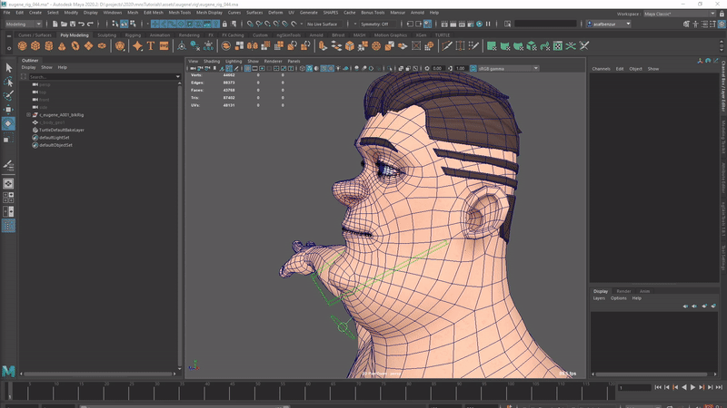

## Mansur-Rig 1.3.3
Released 04 Jul 2021

### Features
- New Interpolated/Weighted orientation in lookAt module. This feature is used to create a weighted split orientation. When you need to create a weighted orientation for a control between two spaces, use this feature.
- Angle-based scale driver feature within the weighted orient feature. Create an angle-based scale driver, to scale the target slave joint when the angle changes between the two sources. Originally designed for double-chin setup
<figure>
  
  <figcaption>Weighted Orientation & Angle Based Scale Driver</figcaption>
</figure>

### Bug fixes
- Added reverseRightSideBindCurves for curveZipB module. In Some cases, the right side symmetrical vertices are in a reversed order. If that is the case, check this new attribute on to fix it.
- Controls default values deletion was not deleting defaults foe the global world control- fixed.
- Added custom defaults save & load on UI-Style control's offset groups. This will allow placing the UI-style control offset groups individually- saving default will now recognize the UI-style controls and save defaults for their offset group parent as well, which will restore the position set by the user.
- Construction was failing when only one FK-Chain was placed under the meta module - Fixed.
- Limb module had an issue with joints changing position on construction. The was a calculation error in the number of segments input to mnsBuildTransformsCurve node which is now fixed.
- Limb module also had some twisting issues when rotating the shoulder, which is now resolved as well.

### Transition Log
- Please use the centralized "Update Rig" utility button in Block's utility tab to update rigs built with previous versions of Mansur-Rig. 

### mnsMayaPlugins v 1.0.9