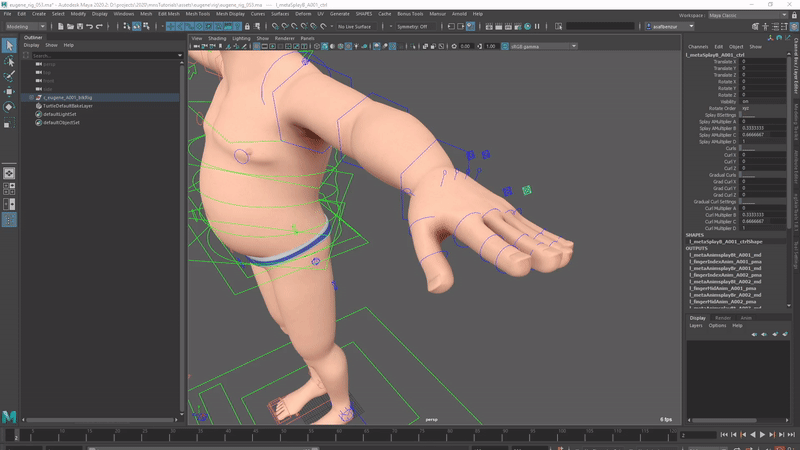

## Mansur-Rig 1.3.5
Released 24 Jul 2021

### Features
- New Curl feature in meta module. Meta module now includes curl channels foe detacted FKChain children on top of the splays.
<figure>
  
  <figcaption>Curl Channels</figcaption>
</figure>

### Bug fixes
- About window wasn't loading on Maya 2022- Fixed
- World Ctrl plg creation bugs fixed
- Limb flip issues improvements

### Transition Log
- Please use the centralized "Update Rig" utility button in Block's utility tab to update rigs built with previous versions of Mansur-Rig. 

### mnsMayaPlugins v 1.0.10

