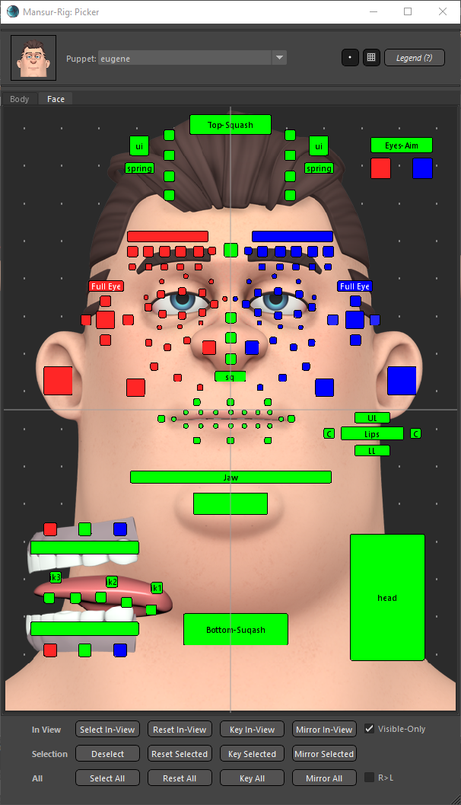

## Mansur-Rig 1.4.0
Released 05 Sep 2021

### Features
- Mocap/Game Tools released! See the <a href = "../../userGuides/Mocap-And-Game-Tools/"><b><u>full documentation here</b></u></a>
<figure>
  
  <figcaption>Mocap Retarget Example</figcaption>
</figure>

- A new picker! See the <a href = "../../userGuides/The-Picker/"><b><u>full documentation here</b></u></a>

<figure>
  
  <figcaption>Mocap Retarget Example</figcaption>
</figure>

- Progress-Bar indication for all Block main tab actions
- ModuleVisUI- UI is will now update automatically based on visibility changes made in the scene

### Bug fixes
- Maya 2022 Block deformation tab bugs
- Maya 2022 About bug
- White-Spaces in my account inputs will now be disregarded
- Some License validation issues in Maya 2019 and above are now fixed
- \#99 - matrixNodes.mll - Maya plugin was added to Mansur-Rig's auto load list, as it is required for Block to function proporly.

### Transition Log
- Please use the centralized "Update Rig" utility button in Block's utility tab to update rigs built with previous versions of Mansur-Rig. 
- In order to use the new Mocap tools feature, please recustruct rigs made with previous versions of Mansur-Rig.

### mnsMayaPlugins v 1.0.10

