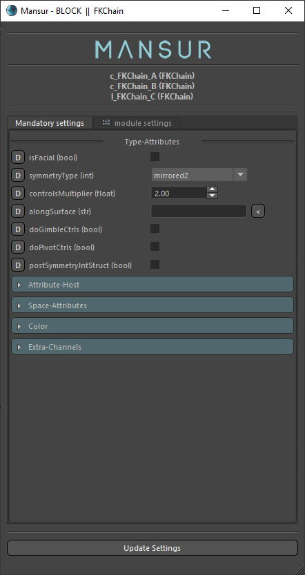
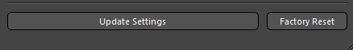
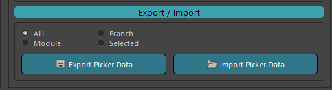
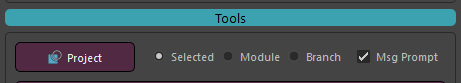
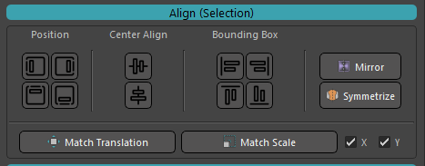
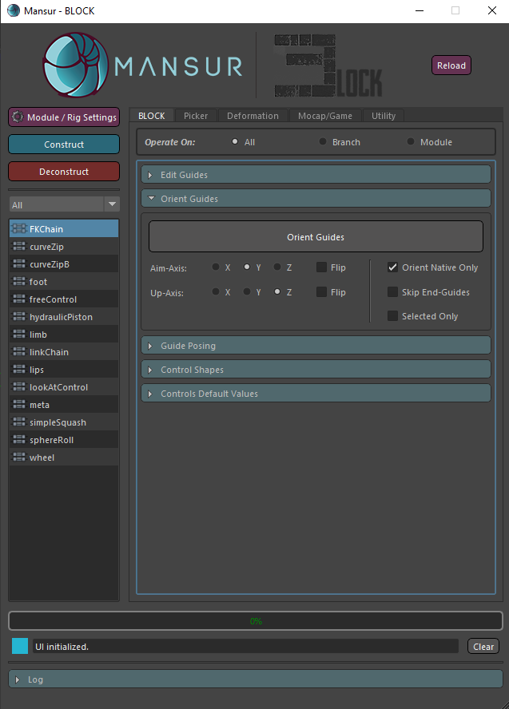

## Mansur-Rig 1.4.1
Released 27 Sep 2021

### Features
- Module Batch edit settings- edit multiple modules using the same settings window. If case you choose multiple modules of the same type, all settings will be vailable for edit. In case you choose mutiple modules of different types, only common settings tab will be available.
<figure>
  
  <figcaption>Module Setting Batch Edit</figcaption>
</figure>
- Module "Factory-Reset" implemented. This feature isn't available in batch edit mode
<figure>
  
  <figcaption>Factory reset button in module settings window</figcaption>
</figure>
- \#75 - Esc Key interuption during construction/deconstruction
- API-Style Construction/Deconstruction support. See the <a href = "../../userGuides/Scripted-Builds/"><b><u>full documentation here</b></u></a>
- Construction/Deconstruction Maya help line progress bar implemented.
- Picker data import/export implementation
<figure>
  
  <figcaption>Picker Data Import Eport</figcaption>
</figure>
- PLG Projection utility was extended to Module and Barnch modes
<figure>
  
  <figcaption>PLG Projection Section</figcaption>
</figure>
- New Translation/Scale mathching utilities in the picker tab.
<figure>
  
  <figcaption>New match buttons in Picker tab</figcaption>
</figure>
- Implemented double-right-click in picker- This will "reset hierarchy"
- New Guides-Orient ability
<figure>
  
  <figcaption>Orient-Guides Section</figcaption>
</figure>

### Bug fixes
- Maya 2022 Skin Utilities fixed
- Picker double-click fixed
- Maya 2022 Version-Manager Downalod bug fixed
- Maya 2022 Installation from path with white-spaces issues fixed
- Menu title name changed to "Mansur-Rig" 
- Block's main tab layout was converted to a scroll area to accomedate all widgets in case all drop-down menus are collapsed
- Squash Module- Missing slave-control added
- \#103 - Offset Skeleton wasn't working well with freeControl module as tweaker. Fixed- Please reconstruct.

### Transition Log
- Please use the centralized "Update Rig" utility button in Block's utility tab to update rigs built with previous versions of Mansur-Rig. 

### mnsMayaPlugins v 1.0.11

