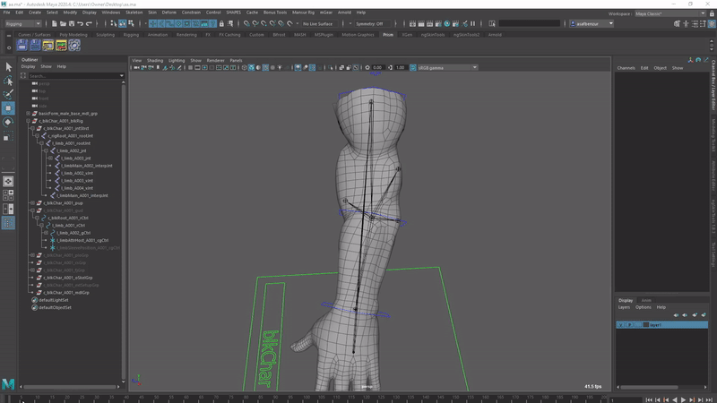
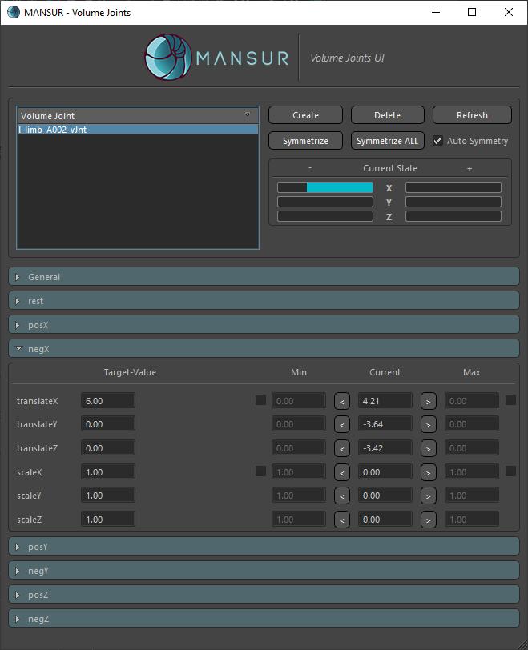
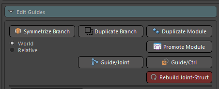
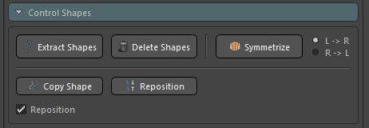
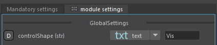
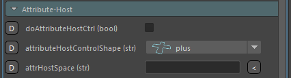

## Mansur-Rig 1.4.2
Released 17 Oct 2021

### Features
- A completly new and very powerful feature- Mns-Volume-Joints! You can now create volume joints to refine and enhence you deformations. These joints are driven by 2 parent+child joints. Using the new UI, you can choose actions (translation/scale) to take for every angle direction between the 2 joint drivers. Please see the <a href = "../../userGuides/Volume-Joints/"><b><u> full documentation here</u></b></a> for full info.
<figure>
  
  <figcaption>Volume Joints Demo</figcaption>
</figure>
<figure>
  
  <figcaption>Volume Joints UI</figcaption>
</figure>
- New much stabler and more intuative Embedded-IK mode in FK Chain
- Free Control- Mesh tweakers can now be rotation controlled as well. Now, in case you cohose so, the mesh tweaker control will not only follow the mesh's position, it will also follow it's rotation.
- New position river mode in Mesh-Tweaker section- new ability to rivet to the closest-vertex as well as the original closest face center.
- New "Rebuild Joint-Structure" utility in Block.
<figure>
  
  <figcaption>Rebuild Joint-Structure button</figcaption>
</figure>
- New control shapes utilities- Copy Shape & Reposition. Copy will allow you to copy a shape from a different control, or create a whole new control shape from scratch and copy it to a Block-control. Reposition will simply center control shape based on the objects-pivot.
<figure>
  
  <figcaption>Control-Shapes Utilities</figcaption>
</figure>
- New "Text Control Shape" feature added as a core ability. You can now select to create a Nurbs-Curve text control shape. This is mainly useful for Attribute-Host controls, in case you want to make them extra distict by setting their control shapes to "Vis", "UI" or "FK/IK" for example.
<figure>
  
  <figcaption>Text Control-Shapes</figcaption>
</figure>
- \#100- Attribute Host space- You can now set a space for the attribute-host control. This space will be the parent space for the host to follow. This cannot be changed post contruction.
<figure>
  
  <figcaption>Attribute-Host Space</figcaption>
</figure>

### Bug fixes

### Transition Log
- Please use the centralized "Update Rig" utility button in Block's utility tab to update rigs built with previous versions of Mansur-Rig. 

### mnsMayaPlugins v 1.0.12
- new mnsVolumeJoint node
- added rotation solve to mnsSimpleRivets
