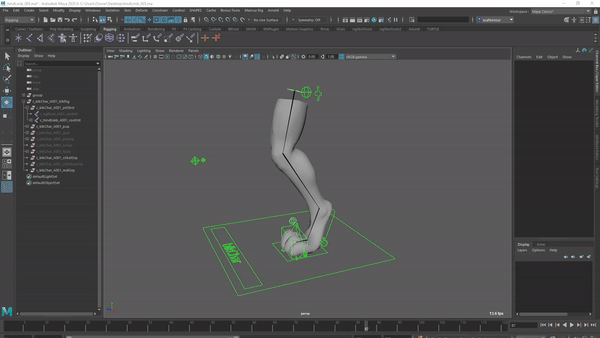
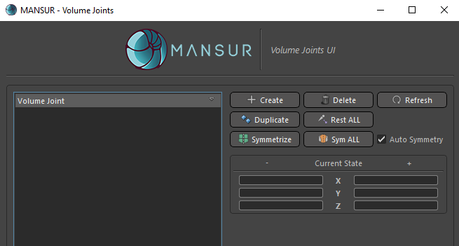

## Mansur-Rig 1.4.3
Released 31 Oct 2021

### Features
- Hind Limb Module- A new module to handle quadruped hind limbs.
<figure>
  
  <figcaption>New Volume Joints Utils</figcaption>
</figure>
- Round-Square control shape added globally into the system.
- Volume Joints UI Utilities
    - Set Rest Pose For All - Set rest pose as current for all volume joints.
    - Duplicate Volume Joint- Duplicate selected colume joint
<figure>
  
  <figcaption>New Volume Joints Utils</figcaption>
</figure>
- Volume Joints UI - Update UI selection based on viewport selection added

### Bug fixes
- Volume joints UI icons
- Control shape reposition method undo not working well
- \#102 - Character definition UI not parented to main window

### Transition Log
- Please use the centralized "Update Rig" utility button in Block's utility tab to update rigs built with previous versions of Mansur-Rig. 

### mnsMayaPlugins v 1.0.12