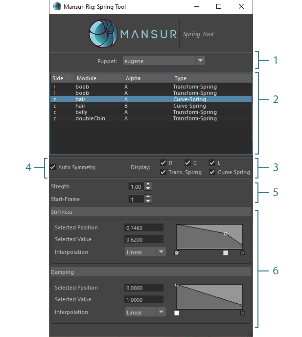
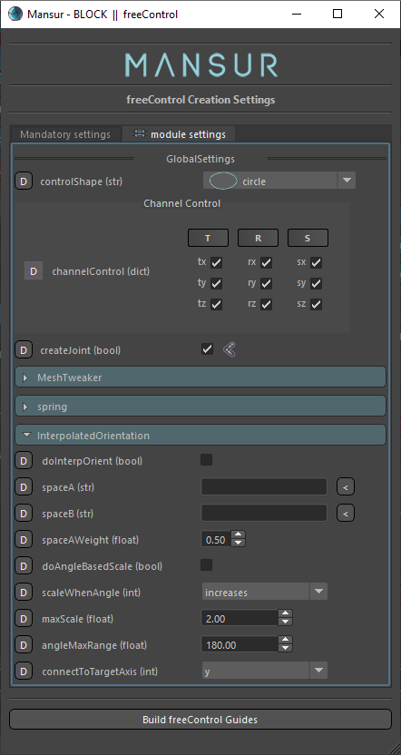
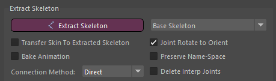

## Mansur-Rig 1.4.5
Released 20 Nov 2021

### Features
- Spring Tool - Please see the <a href = "../../userGuides/Spring-Tool/"><b><u> full documentation here</u></b></a> for full info.
<figure>
  
  <figcaption>Spring Tool UI</figcaption>
</figure>
- Free-Control Module- Added interpolated orientation feature
<figure>
  
  <figcaption>Free-Control- Interpolated Orientation</figcaption>
</figure>
- Direct-Connection method was added to skeleton extraction utility.
<figure>
  
  <figcaption>Skeleton-Extraction- Direct Connection</figcaption>
</figure>

### Bug fixes
- Picker-Images - JPG image type support is now fixed
- Module Symmetry- A global behaviour was inserted into the system to mirror all attributes that contain a Block node name(i.e. "eyeFollowJnt" in curveZipB module)
- Picker2 - Callbacks optimized to avoid unnecessary duplicate actions
- Picker2 - Control specific visibility changes weren't  handled correctly in the picker UI- fixed.

### mnsMayaPlugins v 1.0.12