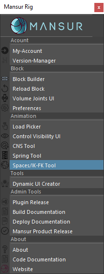

## Mansur-Rig 1.4.6
Released 10 Dec 2021

### Features
- Spaces & FK-IK Tool - Please see the <a href = "../../userGuides/Spaces-IK-FK-Tool/"><b><u> full documentation here</u></b></a> for full info.
<figure>
  
  <figcaption>Spaces Tool UI</figcaption>
</figure>

### Bug fixes
- \#108 - Lip and module isn't behaving as expected in small scales - Fixed.
- \#108- lip module joint struct issues in small scales - Fixed.

### mnsMayaPlugins v 1.0.12