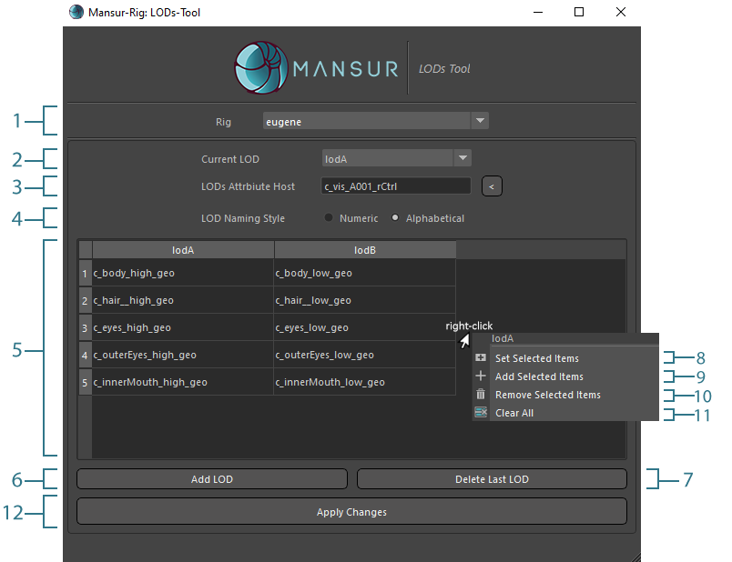
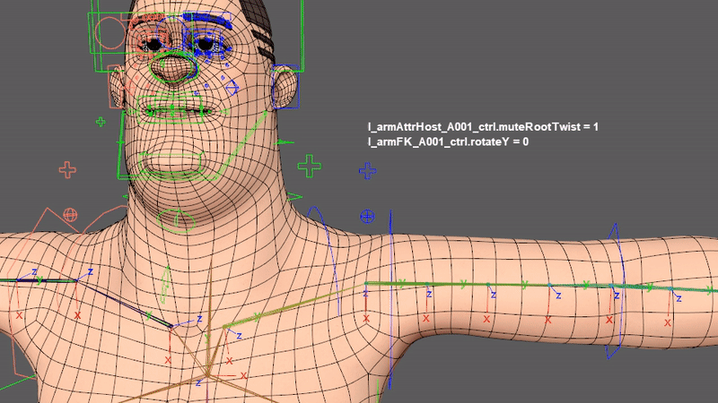
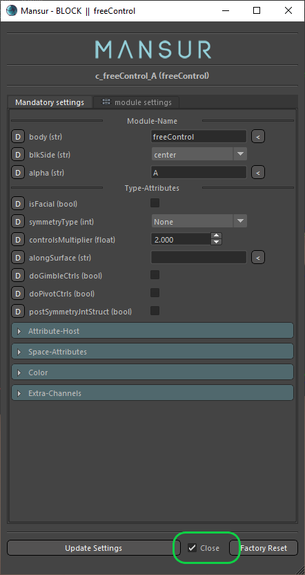
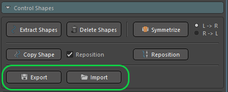
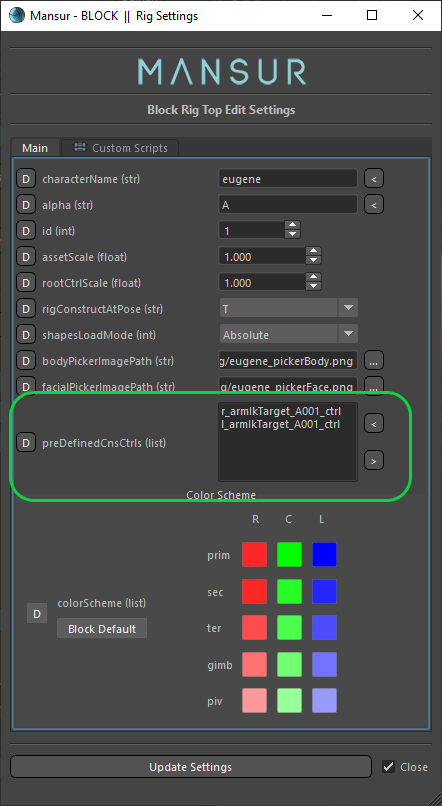
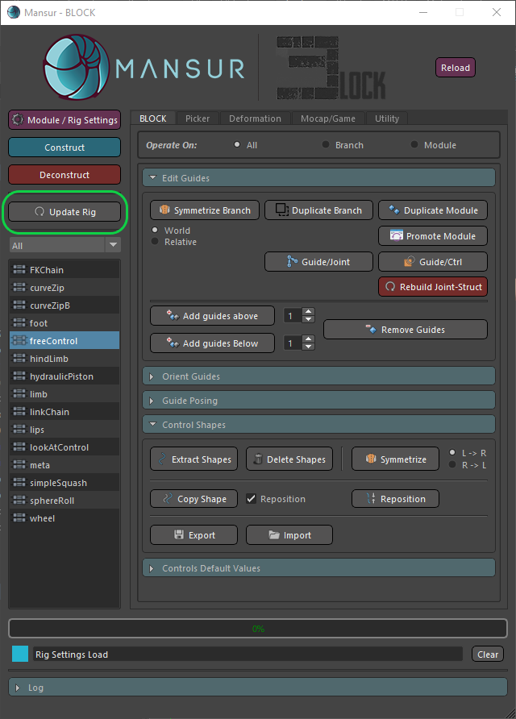
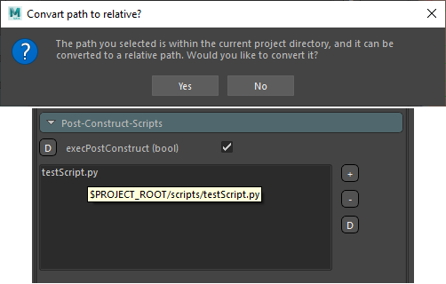
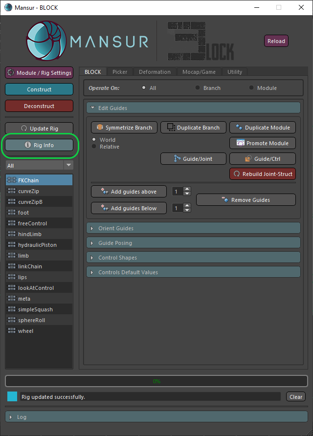
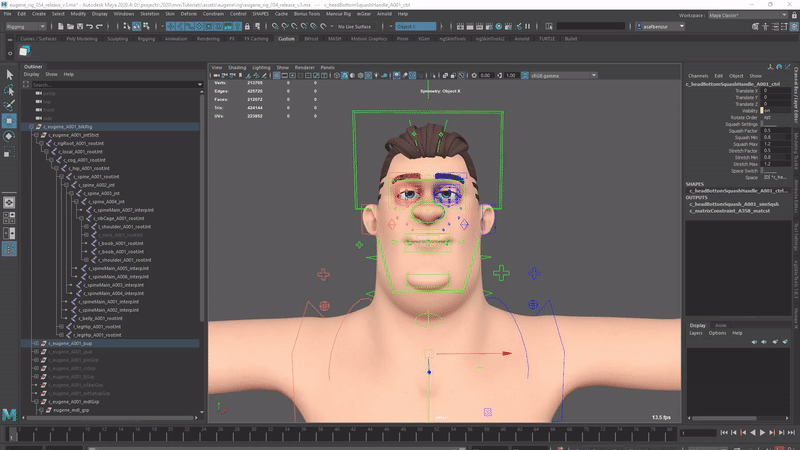

## Mansur-Rig 1.5.0
Released 14 Jan 2022

### Features
- LODs Tool - Please see the <a href = "../../userGuides/LODs-Tool/"><b><u> full documentation here</u></b></a> for full info.
<figure>
  
  <figcaption>LODs Tool UI</figcaption>
</figure>
- "Update Rig" Method is now connected to the main progress bar.
- Limb modules- added new <i>Mute-Root-Twist</i> attribute. You can now choose whether you want to root interpolation to twist with the shoulder root or not, and anywhere in between.
<figure>
  
  <figcaption>Mute Root Twist Demo</figcaption>
</figure>
- New "leave settings window open" value in preferences, to choose not to close the module settings window when pressing "update". The preferences value affects the default value for the new checkbox added in the settings window.
<figure>
  
  <figcaption>Leave Setting Open Choice</figcaption>
</figure>
- Control-Shapes import/export
<figure>
  
  <figcaption>Control-Shapes Import/Export</figcaption>
</figure>
- <a href = "../../userGuides/CNS-Tool/"><b><u>CNS Tool Documentation</u></b></a> added
- Predefined CNS Ctrls Added to rig top attributes. Often it is needed to create CNS controls for animators. As it is slightly inconvenient to do so manually or using custom scripts, a new predefined-CNS controls attribute was added. A CNS control will be created automatically post-construction for every input control within the new attribute list.
 <figure>
  
  <figcaption>Predefined CNS Controls Attribute</figcaption>
</figure>
- Update-Rig utility was added to Block's main static section as well as the old location in Utility tab.
 <figure>
  
  <figcaption>New Update-Rig Button</figcaption>
</figure>
- Custom-Scripts relative paths- In some cases, relative paths for custom scripts can be very useful. When working in a non-production environment, it is sometimes useful to point to a custom script using a relative path to the Maya Project root directory. In case the selected custom script path is within the current Maya Project directory, a new pop-up question window will load, allowing users to choose to convert the selected path to a relative path format. This new relative path will be re-converted to the absolute path dynamically pre-execution.
 <figure>
  
  <figcaption>Custom Scripts Relative Paths</figcaption>
</figure>
- New version available indication in main menu
- Rig info feature- rig construction will now log construction data. To load rig-info post construction use the new "Rig Info" button in block
 <figure>
  
  <figcaption>Rig Info Button</figcaption>
</figure>
- Custom Guides Shapes Posing- Saving poses will now store custom guides shape when relevant. 
- curveZipB Module now supports bind tweaks for deforming eyelids pre-construction. This was created mainly to allow rigging a closed eyes model. Use the new "doBindTweaks" attribute within the curveZipB module- that will create edittable curves that can be editted pre-construction.

### Bug fixes
- Twisting Issues with upper limb up node are now resolved. In previous versions, there were a few scenarios where the shoulder flipped. This has been resolved both in Limb & Hind-Limb modules, and the upper section of the limb is now fully stable. 
- Errors when trying to batch render a scene with a Block-Rig present- Fixed. Batch rendering with a Block rig within the scene is now fully supported.
- Squash module decendents behaviour- Squash module decentent behaviour was fully stabalized and will now yeild expected results.
<figure>
  
  <figcaption>Squash Module Decendents</figcaption>
</figure>
- Load rig setting when rig-top is selected isn't working - Fixed.
- Update Rig isn't updating Rig-Top attributes- Fixed.
- OC Group is created for all ctrls- Fixed.
- Regained Maya 2017 support.
- Some limb related un-wanted warnings in construction and deconsruction were removed.
- FK Chain Module- Some issues were found with embeddedIK to FK controls inheritence. These issues are now resolved and the embedded IK layer was stabalized.

### Transition Log
- Please restore Mansur-Rig default preferences. Go to Mansur-Rig Main Menu -> Preferences -> Restore Defaults
- Please use the centralized "Update Rig" utility button in Block's utility tab to update rigs built with previous versions of Mansur-Rig. 

### mnsMayaPlugins v 1.1.1
- Parametrically Uniform mode in mnsPointsOnCurve Node
- Periodic form mode in buildTransformsCurveNode

