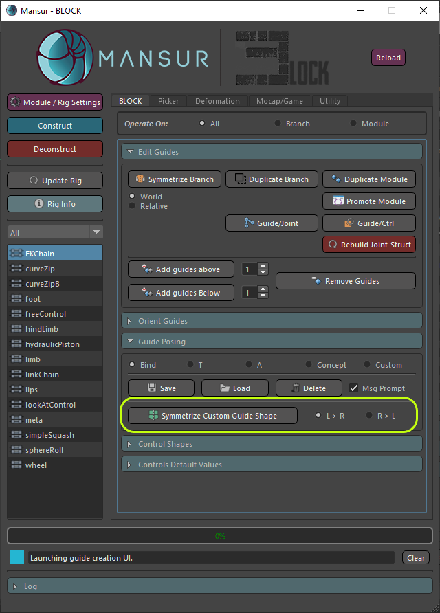
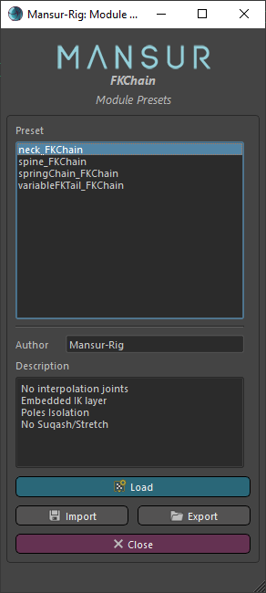
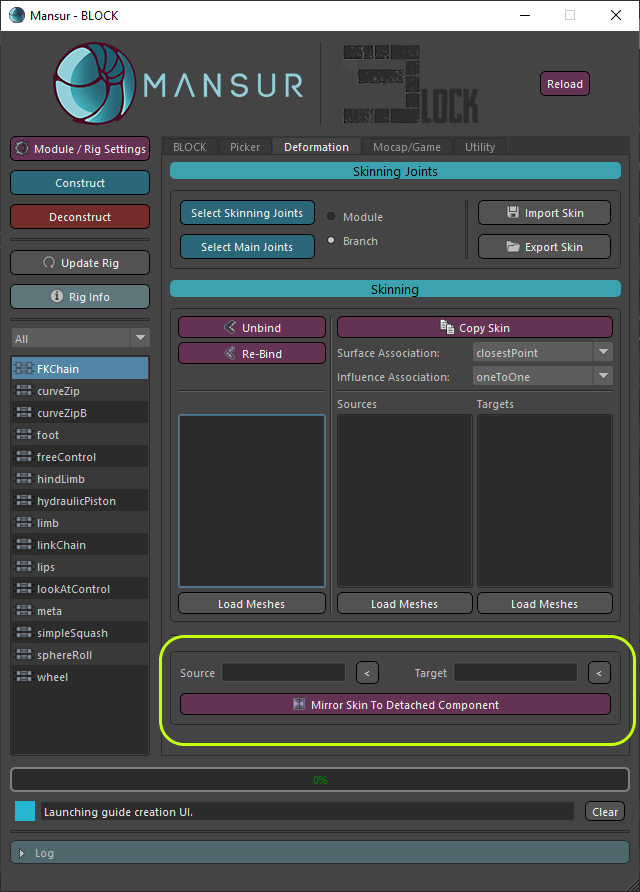

## Mansur-Rig 1.5.2
Released 6 Feb 2022

### Features
- Symmetrize Custom-Guide shape utility - A new utility to symetrize a custom guides Nurbs-Curve Shape.
<figure>
  
  <figcaption>Symmetrize Custom Guide Shape Utility</figcaption>
</figure>

- Module Preset Editor - Please see the <a href = "../../userGuides/Module-Preset-Editor/"><b><u> full documentation here</u></b></a> for full info.
<figure>
  
  <figcaption>Module Preset Edit Dialog</figcaption>
</figure>
- \#97 - Mirror Skin To Detached Component Utility- A new method for mirroring skin to a detached symetrical mesh.
<figure>
  
  <figcaption>Mirror Skin To Detached component tool</figcaption>
</figure>

### Transition Log
- Please use the centralized "Update Rig" utility button in Block's utility tab to update rigs built with previous versions of Mansur-Rig. 

### mnsMayaPlugins v 1.1.1
