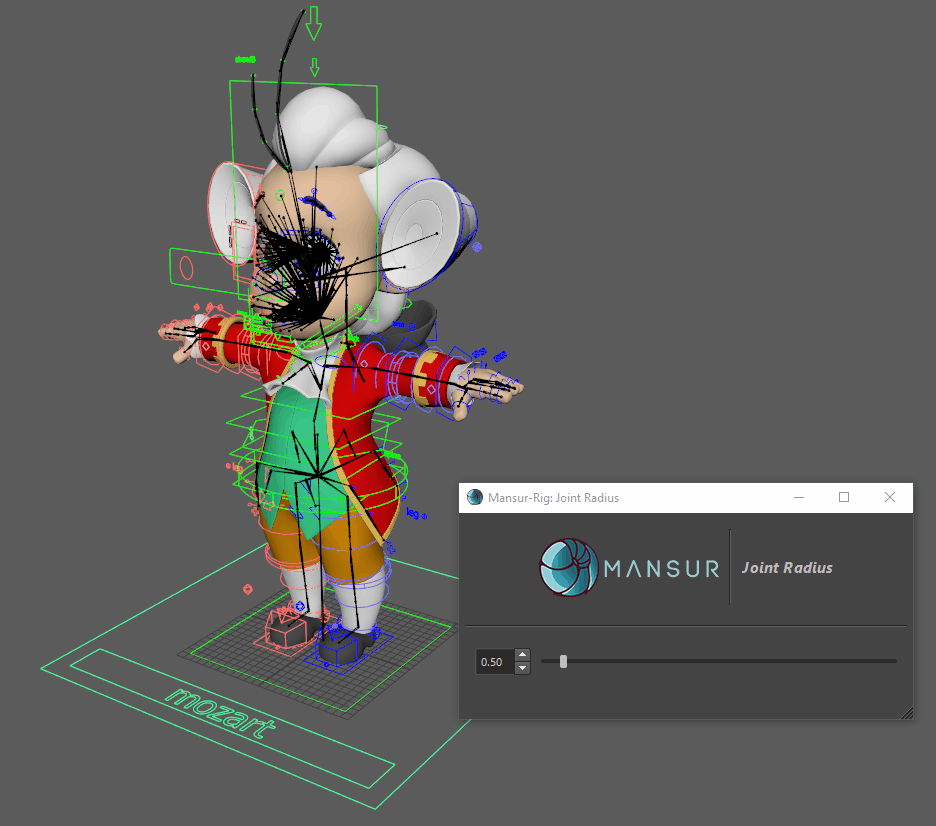
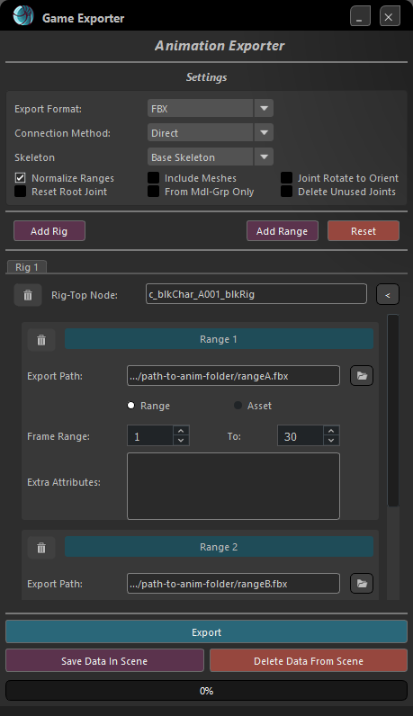

## Mansur-Rig 2.3.0
Released 23 Aug 2023

### Features
<ul>
<li><b>Guide Posing Absolute/Relative Modes</b> - Guide posing can now be saved/loaded in an absolute world value format.</li>
<li><b>FK Chain Module</b> - Added a new feature to control all axes curls for the primary chain in a single channel. On by default. Please use the centralized "Update Rig" utility button in Block's utility tab to update rigs built with previous versions of Mansur-Rig.</li>
<li><b>Joint Radius Tool - A Simple tool to control joint-radius for rigs is now vailable. Please see the <a href = "../../userGuides/Joint-Radius/"><b><u> full documentation here</u></b></a> for full info.
	<figure>
	  
	  <figcaption>Joint Radius Tool</figcaption>
	</figure>
</li>
<li><b>Game Exporter Tool - A A new tool to easily extract asset and animated skeletons. Please see the <a href = "../../userGuides/Game-Exporter/"><b><u> full documentation here</u></b></a> for full info.
	<figure>
	  
	  <figcaption>Joint Radius Tool</figcaption>
	</figure>
</li>
</ul>

### Bug Fixes
- LipsB Module- customMid locators intial visibility was not set correctly- Fixed.
- Extract control shapes isn't working when selecting the rigTop- Fixed.
- Double name-space causes picker to malfunction- Fixed.
- Buggy toggles on picker cameras- Fixed.
- FKChain- When using VariableFK Layer, main curve interp MUST be uniform- Implemented.
- Maya 2024 syntax warnings- Corrected.

### mnsMayaPlugins v 2.2

### Transition Log
- Please use the centralized "Update Rig" utility button in Block's utility tab to update rigs built with previous versions of Mansur-Rig. 
