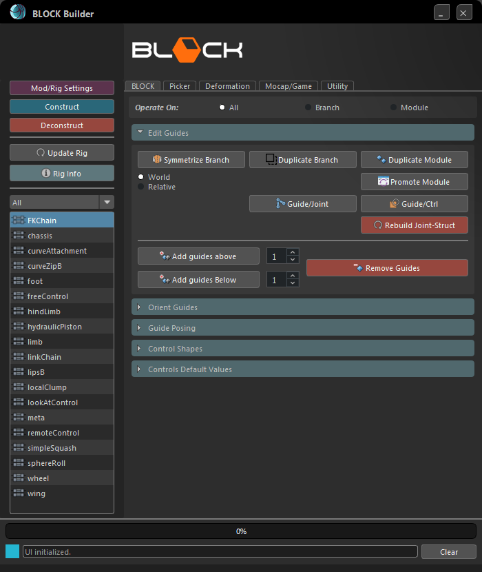
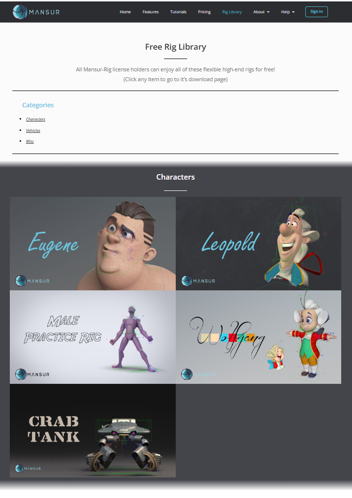
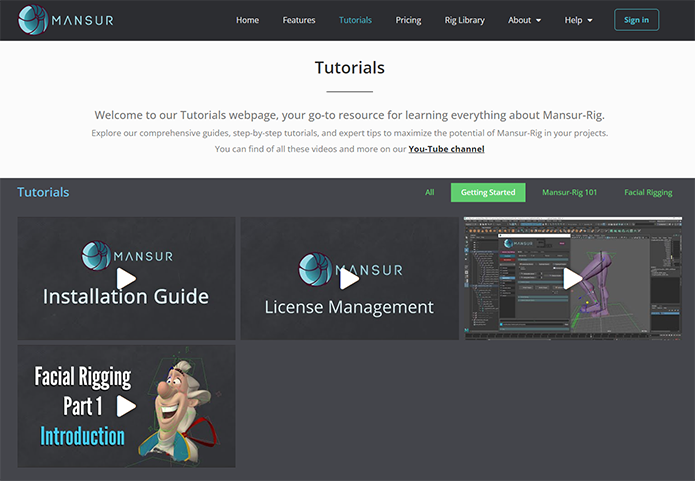
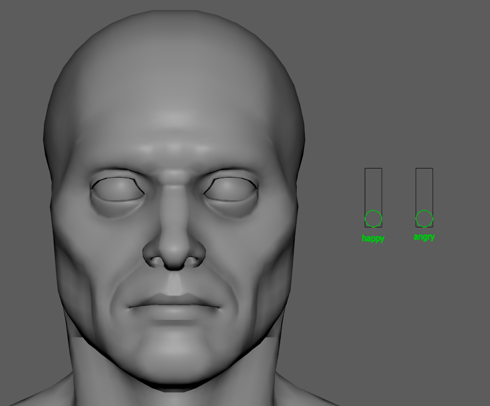
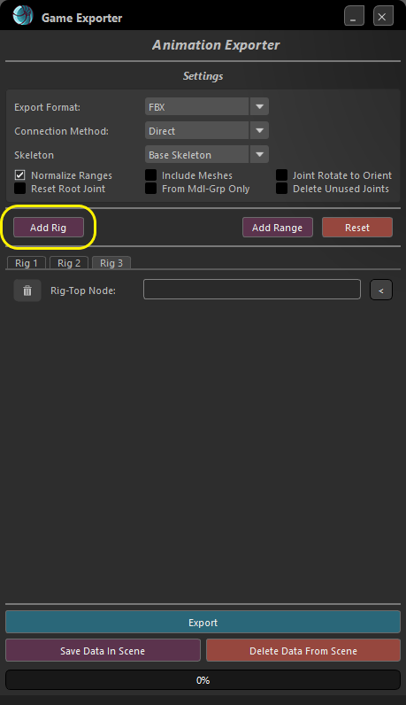
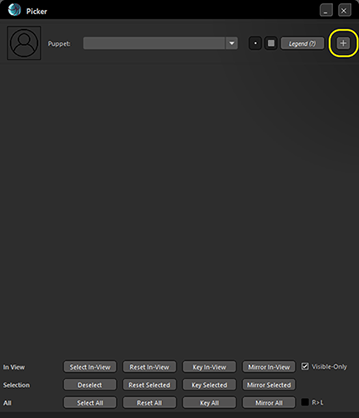
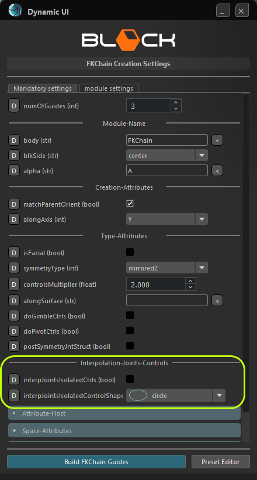

## Mansur-Rig 2.5.0
Released 15 Apr 2024

### General
<ul>
	<li><b>A complete makeover to the entire toolset!</b>
		<figure>
		  
		  <figcaption>A complete makeover!</figcaption>
		</figure>
	</li>
	<li><a href = "https://mansur-rig.com/free-rig-library/" target= "_blank"><b><u>A new self-hosted Free-Rig-Library download page!</u></b>
		<figure>
		  </a>
		  <figcaption>Rig-Library Page</figcaption>
		</figure>
	</li>
	<li><a href = "https://mansur-rig.com/tutorials/" target= "_blank"><b><u>A new self-hosted tutorial page!</u></b>
		<figure>
		  </a>
		  <figcaption>Tutorials Page</figcaption>
		</figure>
	</li>
</ul>

### Modules
<ul>
	<li><b>Remote-Control</b>-
		<ul style="list-style-type:circle;">
			<li>Example use:
				<figure>
				  
				</figure>
			</li>
			<li>
				<u>Best used for</u>: Blend Shape Targets, Facial-Remotes, General Extra-Setups
			</li>
			<li>
				This module, upon construction, will create a remote-control style control.
				 It will create a frame, with a control within, limited to that frame.
				 The frame range is dictated by the settings below.
				 Use the min-max values for both vertical and horizontal directions to create the remote that best fitting to your needs.
				 You can freely use both vertical and horizontal directions in combination.
				 This type of control is often seen when creating a blend-shape-based facial rig, with an adjacent remote control to easily and visually animate the targets instead of using the channel box directly.
				 
				 Also, you can control the target value range for your control.
				 That means that the control and target ranges can differ.
				 For example, a blend shape target with values between 0 and 1 is needed to be controlled.
				 You can set the control range between 0 and 5, while keeping the target range between 0 and 1, which will result in a slower behaving control for more fidelity.
				 
				 The target connection is handled post-construction so connecting to constructed objects is also possible.
				 Multiple targets can be input into the same target. Simply select multiple targets and input. Alternatively manually input the targets, separated by commas.
			</li>
		</ul>
	</li>
</ul>

### Features
<ul>
	<li><b>Game Exporter</b>
		<ul style="list-style-type:circle;">
			<li><i><u>Export multiple rigs from the same scene</i></u>- It is now possible to export animations for multiple rigs at the same time. This feature is backward compatible.</li>
			<li><i><u>Blend-Shapes Handling</u></i>- Game exporter is now able to handle blend shapes as well as skin clusters. In case export-geometry is set to True, and a blend-shape node is found on one of the located skinned geometries, the game exporter will automatically re-create the blend-shape nodes and keys on export.</li>
			<li><i><u>Export geometry from mdlGrp only</i></u>- Normally, all skinned meshes to the selected skeleton will be extracted. If this option is checked, only geometry under Block's Model-Group will be extracted.</li>
			<li><i><u>"Root joint reset" option</u></i>- If this option is checked, after asset/animation extraction, animation for the root joint will be deleted, and transforms will be reset to origin.</li>
			<li><a href = "../../userGuides/Game-Exporter/"><b><u>Updated Guide Here</u></b></a>
				<figure>
				  
				  <figcaption>New Game Exporter</figcaption>
				</figure>
			</li>
		</ul>
	</li>
	<li><b>Picker</b>- multiple picker instances are now supported.
		<figure>
		  
		  <figcaption>New Picker Instance Button</figcaption>
		</figure>
	</li>
	<li><b>Block Builder</b>- A new global setting is introduced: <i><u>Interp Joints Isolated Controls.</i></u>
		 When this setting is checked, and the current module is set to create Interpolation-Joints, on construction all Interpolation joints will receive individual isolated ctrl on top of any previous behaviour.
		<figure>
		  
		  <figcaption>Interpolation Joints Isolated Ctrls</figcaption>
		</figure>
	</li>
	<li><b>Joint Radius Tool</b> 
		<ul style="list-style-type:circle;">
			<li>This tool is now set to update once a selection within the scene changes, to avoid needing to reset this tool.</li>
			<li>This tool now supports Block rigs with namespaces, to enable use in animation as well.</li>
		</ul>
	</li>
	<li><b>Visibility attribute on all controls made un-keyable</b>- In previous versions, the visibility channel for all controls was controlled via an AnimCurves nodes, which caused the visibility channel to appear in Maya's Graph-Editor. To avoid this inconvenience, a new dedicated node was introduced- mnsModuleVis. Instead of using Maya's AnimCurves node, this new node is used to prevent control's visibility channel appear in the Graph-Editor.</li>
	<li><b>Change IK-FK attribute on Limb modules to an Int</b>- IK-FK attribute float blending was causing multiple issues on many cases, so it was changed to an Int type, disabling blending.</li>
</ul>

### Bug Fixes
- Maya 2022 and above version Manager download doesn't work- Fixed.
- Game Exporter- Skin isn't transferring cleanly- Fixed.
- LipsB- Weird issue with Maya 2022 onwards- joints are not created on selected vertices- Fixed.
- Absolute pose loading- implemented load sequence by highest descendent downwards to make sure poses are loaded correctly in absolute mode.
- Maya 2024 PyMel attr setMin and setMax don't work- Fixed. Changed to Maya's setAttr command.
- Remote-Control style controls are storing default poses post construction- Fixed. The auto trigger for default value save on construction was removed.
- Pose modes attributes aren't set to hidden- Fixed.
- Picker- Selection display issues with a scene containing 2 rigs without a namespace- Fixed.
- When using limb/hindLimb modules in combination with the foot module, the limb's last interp joint should be excluded from skinning-joints selection- Implemented.
- IK-FK match- sometimes doesn't match exactly- Fixed. IK-FK Match function was reviewed and corrected.
- Free Control- Using free control without a joint is causing sub-module joints to build with offset- Fixed.

### mnsMayaPlugins v 2.5
- <b>mnsModuleVis Node</b>- A Simple dedicated node to control module visibility. Previously was done using 3 animCurvesUU nodes, this is designed to replace them.

### Transition Log
- <b>Rigs built using this version of Mansur-Rig are <u>NOT backward compatible</u>. Rigs built using this version can only be opened using 2.5.0 and above, since a new node was introduced into the core build (mnsModuleVis).</b>
- Please use the centralized "Update Rig" utility button in Block's utility tab to update rigs built with previous versions of Mansur-Rig. 